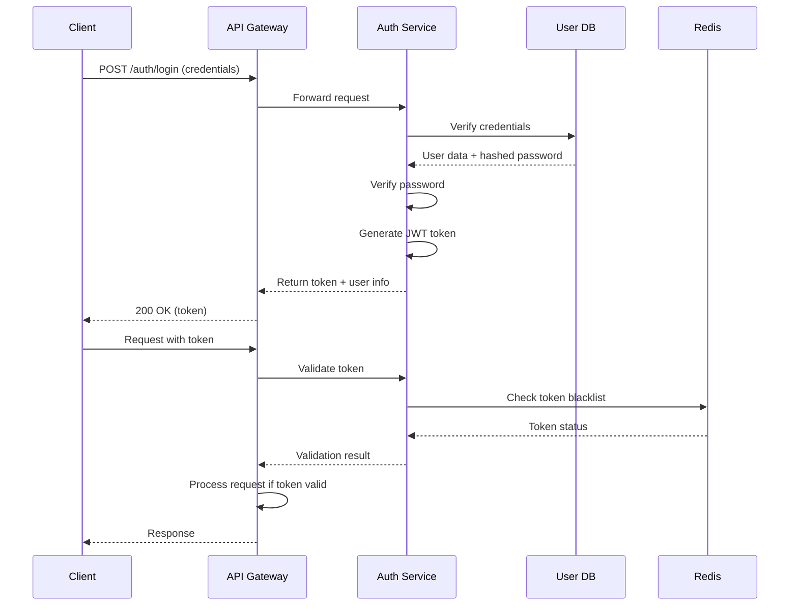
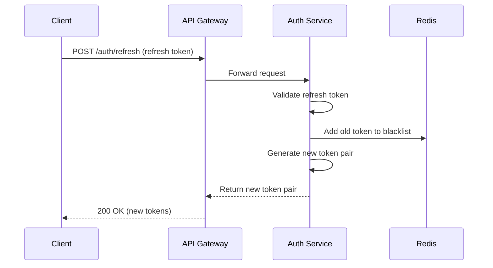

# TechSaaS Authentication System Architecture

This document provides a comprehensive technical overview of the TechSaaS authentication and authorization architecture, including design decisions, data flows, and integration points.

## System Architecture

The authentication system is built as a modular component within the TechSaaS platform, following these architectural principles:

1. **Stateless JWT Authentication** - No server-side session storage required
2. **Defense in Depth** - Multiple security layers to protect resources
3. **Role and Permission Based Access Control** - Fine-grained authorization
4. **Subscription Tier Integration** - Feature access tied to monetization strategy
5. **API-First Design** - Authentication system exposed via well-defined APIs


## Component Breakdown

### 1. Authentication Core

The core authentication module handles:

- User identity verification
- JWT token generation and validation
- Password hashing and verification
- Token refresh and blacklisting

Technology choices:
- PyJWT for token handling
- Bcrypt for password hashing
- Redis for token blacklist/revocation

### 2. Authorization Layer

The authorization module implements:

- Role-based access control (RBAC)
- Permission-based authorization
- Subscription tier feature access
- Resource ownership validation

Key interfaces:
- `@jwt_required` - Primary decorator for protected routes
- `@has_permission` - Permission-based access control
- `@requires_role` - Role hierarchy validation
- `@check_feature_access` - Subscription tier feature access

### 3. User Identity Store

Identity information persisted in:

- PostgreSQL database for user credentials and profile
- Redis for token blacklist and rate limiting

Schema design:
```sql
CREATE TABLE users (
  id UUID PRIMARY KEY,
  email VARCHAR(255) UNIQUE NOT NULL,
  password_hash VARCHAR(255) NOT NULL,
  name VARCHAR(255),
  role VARCHAR(50) DEFAULT 'user',
  tier VARCHAR(50) DEFAULT 'free',
  created_at TIMESTAMP DEFAULT CURRENT_TIMESTAMP,
  updated_at TIMESTAMP DEFAULT CURRENT_TIMESTAMP
);

CREATE TABLE user_permissions (
  user_id UUID REFERENCES users(id),
  permission VARCHAR(100) NOT NULL,
  granted_at TIMESTAMP DEFAULT CURRENT_TIMESTAMP,
  PRIMARY KEY (user_id, permission)
);
```

### 4. API Gateway Integration

The authentication system integrates with the API gateway for:

- Request validation
- Rate limiting
- API key authentication (separate from user authentication)
- Usage tracking for monetization

## Data Flow

### Authentication Flow



### Token Refresh Flow



## Security Model

### Token Design

**Access Token Structure:**
```json
{
  "sub": "user-123",        // Subject (user ID)
  "email": "user@example.com",
  "role": "premium",
  "tier": "professional",
  "permissions": ["read:own_data", "create:own_content"],
  "iat": 1619799332,        // Issued at timestamp
  "exp": 1619802932         // Expiration timestamp
}
```

**Refresh Token Structure:**
```json
{
  "sub": "user-123",
  "token_type": "refresh",
  "jti": "unique-token-id-123",  // JWT ID for revocation
  "iat": 1619799332,
  "exp": 1620404132              // Longer expiration (7 days)
}
```

### Security Controls

1. **Token Expiration**:
   - Access Tokens: 30-60 minutes
   - Refresh Tokens: 7 days

2. **Token Revocation**:
   - Redis-based token blacklist
   - Invalidation on logout
   - Invalidation on password change
   - Refresh token rotation

3. **Password Security**:
   - Bcrypt hashing with configurable work factor
   - Password complexity requirements enforced
   - Brute force protection via rate limiting

4. **Transport Security**:
   - HTTPS required for all requests
   - Secure cookie flags (HttpOnly, Secure, SameSite)
   - Content Security Policy headers

## Role Hierarchy and Permissions

### Role Hierarchy

```
superadmin > admin > premium > user
```

1. **User** (Level 0):
   - Basic platform access
   - Access to own resources
   - Limited feature set

2. **Premium** (Level 1):
   - Enhanced feature access
   - Higher rate limits
   - API access

3. **Admin** (Level 2):
   - Administrative access
   - User management
   - Content moderation

4. **Superadmin** (Level 3):
   - System configuration
   - Full access to all features
   - Billing management

### Permission Schema

Permissions follow the `resource:action` format.

Core permissions:
- `read:own_data` - Read user's own data
- `create:own_content` - Create content owned by the user
- `delete:own_data` - Delete user's own data
- `admin:view` - View administrative data
- `admin:edit` - Edit administrative data
- `api:access` - Access API endpoints

## Tier-Based Feature Access

The tier-based feature access system enables the monetization strategy by restricting features based on subscription level:

| Feature | Free | Basic | Premium | Professional | Enterprise |
|---------|------|-------|---------|--------------|------------|
| Data Exports | ❌ | ✅ | ✅ | ✅ | ✅ |
| Advanced Analytics | ❌ | ❌ | ✅ | ✅ | ✅ |
| AI Features | ❌ | Basic | Advanced | Advanced | Advanced |
| API Access | ❌ | ❌ | ✅ | ✅ | ✅ |
| Rate Limits | 10/min | 100/min | 1000/min | 5000/min | Unlimited |

Implementation details:
```python
TIER_FEATURES = {
    'free_feature': ['free', 'basic', 'premium', 'professional', 'enterprise'],
    'basic_feature': ['basic', 'premium', 'professional', 'enterprise'],
    'premium_feature': ['premium', 'professional', 'enterprise'],
    'pro_feature': ['professional', 'enterprise'],
    'enterprise_feature': ['enterprise']
}
```

## API Usage Tracking and Monetization

The authentication system integrates with usage tracking for API monetization:

1. **Token Identification**:
   - Each API request is associated with a user via JWT token
   - Anonymous requests tracked via API keys

2. **Usage Recording**:
   - Request counts by endpoint
   - Resource consumption (e.g., compute time, tokens processed)
   - Storage usage

3. **Tier-Based Rate Limiting**:
   - Enforced at the API Gateway level
   - Different limits based on subscription tier
   - Configurable per-endpoint

4. **Billing Integration**:
   - Usage data exported to billing system
   - Pay-per-use model for specific API endpoints
   - Usage aggregation by time period (daily, monthly)

## Configuration

The authentication system is highly configurable through environment variables:

### Core Authentication Configuration

```
# JWT settings
JWT_SECRET_KEY=your-secret-key
JWT_ALGORITHM=HS256
JWT_ACCESS_TOKEN_EXPIRES=30m  # 30 minutes
JWT_REFRESH_TOKEN_EXPIRES=7d  # 7 days

# Password settings
PASSWORD_MIN_LENGTH=8
PASSWORD_REQUIRE_UPPERCASE=true
PASSWORD_REQUIRE_LOWERCASE=true
PASSWORD_REQUIRE_NUMBERS=true
PASSWORD_REQUIRE_SPECIAL=true
BCRYPT_WORK_FACTOR=12

# Token blacklisting
TOKEN_BLACKLIST_ENABLED=true
REDIS_URL=redis://localhost:6379/0
```

### Rate Limiting Configuration

```
# Rate limiting
RATE_LIMITING_ENABLED=true
RATE_LIMIT_DEFAULT=60       # Requests per minute for unspecified endpoints
RATE_LIMIT_AUTH=10          # Requests per minute for auth endpoints
RATE_LIMIT_BY_TIER=true     # Enable tier-based rate limiting

# Tier-based limits (requests per minute)
RATE_LIMIT_TIER_FREE=10
RATE_LIMIT_TIER_BASIC=100
RATE_LIMIT_TIER_PREMIUM=1000
RATE_LIMIT_TIER_PROFESSIONAL=5000
RATE_LIMIT_TIER_ENTERPRISE=0  # Unlimited
```

## Deployment Architecture

The authentication system is designed for high-availability deployment:

```
┌─────────────────┐     ┌─────────────────┐
│   API Gateway   │────▶│ Auth Service #1 │
└────────┬────────┘     └────────┬────────┘
         │                       │
         │              ┌────────┴────────┐
         ├─────────────▶│ Auth Service #2 │
         │              └────────┬────────┘
         │                       │
┌────────┴────────┐     ┌────────┴────────┐
│  User Traffic   │     │   Redis Cluster  │
└─────────────────┘     └────────┬────────┘
                                 │
                        ┌────────┴────────┐
                        │  PostgreSQL DB  │
                        └─────────────────┘
```

### Scaling Considerations

1. **Stateless Services**:
   - JWT eliminates need for shared session state
   - Allows horizontal scaling of Auth Service

2. **Redis Scaling**:
   - Redis Cluster for token blacklist
   - Redis Sentinel for high availability

3. **Database Scaling**:
   - Read replicas for identity lookups
   - Connection pooling

4. **Load Balancing**:
   - Round-robin for Auth Service instances
   - Health checks to remove unhealthy instances

## Integration Points

### Internal Service Integration

Other TechSaaS services integrate with the authentication system via:

1. **JWT Verification Middleware**:
   - Direct integration for internal services
   - HTTP middleware for different frameworks (Flask, FastAPI, Express)

2. **Permission Checking Libraries**:
   - Shared libraries for consistent permission checking
   - Role and permission caching for performance

3. **Service-to-Service Authentication**:
   - Internal service tokens with limited scope
   - Service identity verification

### External API Integration

External developers can integrate with TechSaaS APIs using:

1. **API Authentication**:
   - OAuth 2.0 Authorization Code flow for web applications
   - Personal Access Tokens for script-based integration
   - OAuth 2.0 Client Credentials for server-to-server

2. **API Documentation**:
   - OpenAPI/Swagger specifications
   - Interactive API explorer
   - Postman collections

## Monitoring and Alerting

The authentication system includes comprehensive monitoring:

1. **Key Metrics**:
   - Authentication success/failure rates
   - Token validation rates
   - Token refresh rates
   - Rate limit hits
   - Response times

2. **Alerting Rules**:
   - Unusual authentication failure patterns
   - Sudden increase in token refresh requests
   - Blacklist size growth anomalies
   - High rate of permission denials

3. **Logging**:
   - Structured logging (JSON format)
   - Correlation IDs for request tracing
   - Anonymized authentication events
   - PII protection in logs

## Audit and Compliance

For security auditing and compliance requirements:

1. **Audit Trail**:
   - All authentication events recorded
   - Login/logout events
   - Permission denials
   - Role and permission changes
   - Token invalidation events

2. **Data Retention**:
   - Authentication logs retained for 90 days
   - Authentication metadata retained for 1 year
   - Configurable retention policies

3. **Compliance Support**:
   - GDPR - Data access controls and deletion
   - SOC2 - Security controls and audit trails
   - HIPAA - Access controls for protected data

## Future Enhancements

Planned security enhancements include:

1. **Multi-Factor Authentication**:
   - TOTP (Time-based One-Time Password)
   - SMS verification
   - WebAuthn/FIDO2 support

2. **Enhanced Token Security**:
   - Proof Key for Code Exchange (PKCE)
   - Dynamic token scoping
   - Device binding for tokens

3. **Advanced Authorization**:
   - Attribute-Based Access Control (ABAC)
   - Context-aware authorization
   - Dynamic permission evaluation

4. **Improved Monitoring**:
   - Machine learning for anomaly detection
   - User behavior analytics
   - Threat intelligence integration
